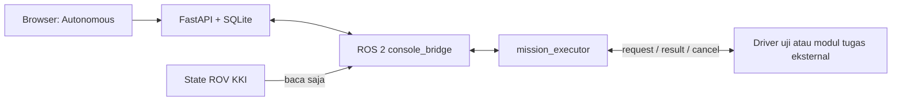

# Platform autonomous ROS 2 — 5 Oktober 2026

Permintaan pengguna: membangun tempat integrasi sistem autonomous SAUVC 2027 dalam HydroShips, di repositori AUV2027. Pengguna kemudian menjelaskan bahwa kode autonomous AUV belum dibuat; proyek ROS 2 sebelumnya dipakai untuk simulasi Gazebo KKI.

## Acuan dan batas penggunaan ulang

Repositori [Customize5773/ros2_ws](https://github.com/Customize5773/ros2_ws/tree/487706b0fe6e950f4b06a5a142b8c369e7c5c76e) diperiksa pada commit `487706b0fe6e950f4b06a5a142b8c369e7c5c76e`. Isinya antara lain `hydroships_control`, `hydroships_bringup`, `hydroships_description`, dan `hydroships_gazebo`. FSM lama mengatur tugas ROV KKI, bukan alur SAUVC. Source kontrol lama tidak disalin atau dijalankan. Topic status `/hydroships/mission/state` dipertahankan sebagai input baca saja untuk kompatibilitas pengamatan.

Workspace lokal `/home/aero/ros2_ws` berisi pekerjaan AGV lain dan tidak diubah. Referensi GitHub dibaca dari cache terpisah di luar repositori AUV2027. Source implementasi baru berada pada `hydroships/ros2_ws/src/auv2027_autonomy`; tidak ada repositori Git baru.

Situs [SAUVC](https://sauvc.org/) telah menampilkan acara 2027; [rulebook yang ditautkan](https://sauvc.org/rulebook/) saat diperiksa masih edisi 2026 v6.1.0. Slot tugas memakai konsep navigation/acquisition/reacquisition/localization sebagai kerangka konfigurasi. Batas waktu, scoring, dan definisi keberhasilan lomba 2027 belum dibekukan dalam kode.

## Hasil implementasi

- Halaman desktop **Autonomous**: tambah/hapus/urutkan tahap, edit waktu, simpan revisi, jalankan/batalkan uji, progres, jejak kejadian, laporan JSON, node/topic ROS, dan kontrol runtime.
- Executor ROS 2 menjalankan tahap berurutan dan menunggu hasil yang cocok. Deadline memakai monotonic clock; hasil terlambat/duplikat tidak memajukan tahap lain.
- Driver sintetis menguji jalur berhasil, gagal, dan tidak merespons. Driver dapat dimatikan untuk menghubungkan node tugas eksternal melalui kontrak request/result/cancel.
- Backend menyimpan rencana serta maksimal 100 riwayat eksekusi dalam SQLite. Revisi mencegah penimpaan rencana antarbrowser. Eksekusi tidak dilanjutkan otomatis setelah gangguan.
- ROS 2 memakai Python sistem dalam proses terpisah; FastAPI tetap memakai virtualenv. Transport ROS menggunakan DDS dan `std_msgs/String`, sedangkan bridge lokal memakai stdin/stdout JSON. Tidak menambah dependensi web/ROS bridge.

## Bukti pengujian pada Jetson

- Inventaris: ROS 2 Humble dan `rclpy` tersedia pada Jetson; belum ditemukan executable Gazebo `gz`/`ign`. Tidak ada node autonomous lama aktif pada pemeriksaan awal.
- Backend: **14 tes lulus**, mencakup validasi rencana, revisi, persistensi, lifecycle misi, transport ROS 2 nyata, abort, timeout, proses ROS dimatikan SIGKILL, serta pemulihan tanpa resume.
- Pemeriksaan tambahan mode eksternal: node sintetis tidak dibuat; tanpa hasil eksternal, skenario nominal tetap gagal karena timeout.
- Browser Chromium: penyuntingan/urutan/hapus/simpan/muat ulang rencana; berhasil/gagal/timeout/abort; unduhan laporan JSON; stop/start runtime; discovery node. Lebar **1280, 1440, 1920** tanpa overflow horizontal, error JavaScript, atau respons HTTP gagal.
- Build frontend Vue/TypeScript berhasil. Package dibangun dan diperiksa sebagai package ROS 2 ament Python.
- Regresi enam halaman lama lulus: alur demo, baca/tulis parameter terkonfirmasi, ekspor, perbandingan cadangan, dan log tetap berfungsi.
- Layanan utama `hydroships.service` diperbarui dan diperiksa melalui browser pada port 8081: tiga node terdeteksi, runtime siap, tidak ada misi berjalan. Koneksi demo yang aktif sebelumnya dipulihkan setelah restart. Layanan uji port 8083 dihentikan setelah pemeriksaan.
- Artefak lokal (diabaikan Git): `hydroships/evidence/ros2-inventory.json` dan `hydroships/evidence/autonomy/`.

Panduan operasi, variabel lingkungan, kontrak topic, serta perintah uji berada di [README workspace ROS 2](../hydroships/ros2_ws/README.md).

## Pekerjaan yang belum diimplementasikan

Belum ada algoritme navigasi/persepsi/akustik SAUVC, adapter Gazebo, mission controller kendaraan fisik, atau keluaran arm/mode/thruster/Pixhawk. Label **software test** membedakan validasi platform dari validasi kemampuan robot. Hasil sintetis hanya membuktikan alur perangkat lunak.

Tahap berikutnya adalah memilih tugas AUV pertama dan membangun node tugas berbasis rekaman atau simulasi menggunakan kontrak yang sudah tersedia. Pengujian hardware menunggu Pixhawk/kamera tersedia di tempat pengujian.
